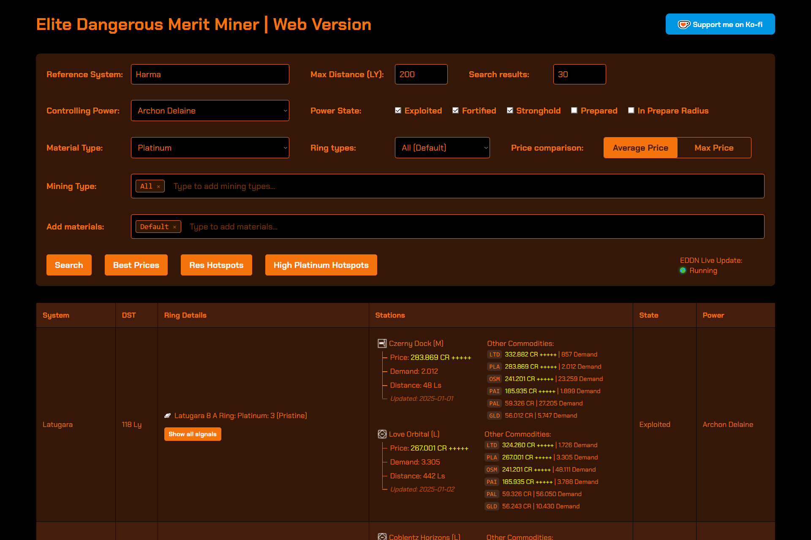
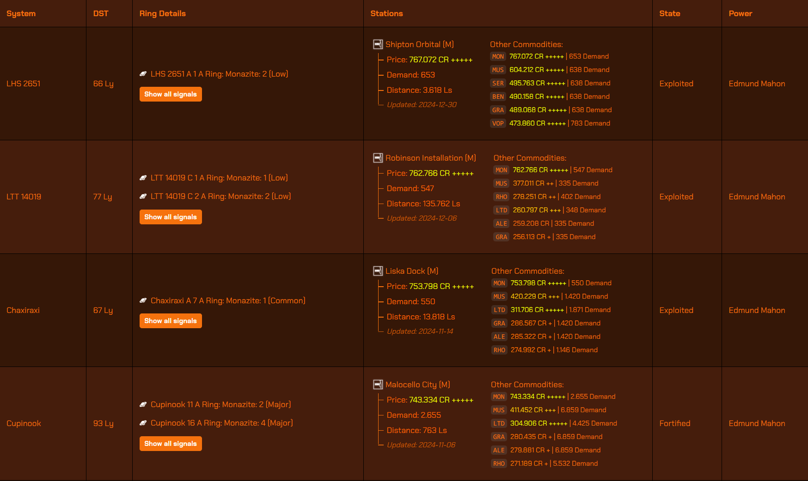
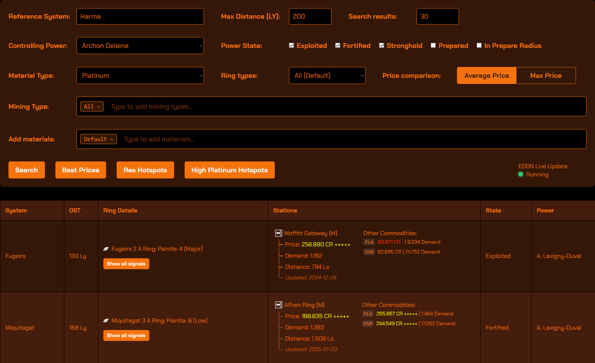
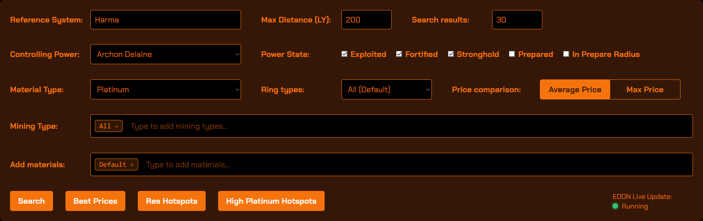

# Elite Dangerous Merit Miner

A specialized mining helper tool for Elite Dangerous that helps you find the most profitable mining locations within your power's territory. It displays optimal mining locations where you can both mine materials and sell them at high prices, showing station demands, planetary ring conditions and hotspot details. 

Adds special search option for res hotspots and high yield platinum hotspots (based on community effort from: https://edtools.cc/) . Lists of hotspots and res sites are probably not complete and will not be updated regularly.



## Features

- Find mining locations within your power's controlled/exploited space
- Display station demands and selling prices
- Show planetary ring conditions and compositions
- Filter by mining type (laser, core mining, etc.)
- Track multiple materials simultaneously
- Compare prices against average and maximum market values
- Special searches for RES hotspots and high-yield Platinum locations
- Support for all major minable materials and metals

## Screenshots




---

## Installation

### Prerequisites

- Python 3.x
- Required Python packages:

```bash
pip install -r requirements.txt
```

### Database Setup

1. Download the required data:
   
   - Get `galaxy_stations.json.gz` from [Spansh Dumps](https://spansh.co.uk/dumps)
   - Place the **extracted json file** in the `json` directory

2. Convert the data:
   
   ```bash
   python converter.py json/galaxy_stations.json systems.db --max-distance 500 --exclude-carriers --trim-entries --compression zstandard 
   ```
   
   Wait for the conversion to complete. This will create your systems database.

3. Configure settings:
   Edit `Config.ini` with your preferences:
   
   ```ini
   [Defaults]
   system = Your reference system name
   controlling_power = Your power faction (check list of website for spelling!)
   max_distance = Search distance in Ly
   search_results = Number of results to display
   system_database = systems.db
   ```

---

## Usage

1. Start the server:
   
   ```bash
   python server.py
   ```

2. Open your browser and navigate to:
   
   ```
   http://127.0.0.1:5000
   ```

3. Start searching and **make profit**! 

---- 



## GUI Guide

### Search Options

- **Material Type**: Select your primary mineral/metal to search for
- **Mining Type**: Choose your preferred mining method (laser, core mining, etc.)
- **Add Materials**: Include additional materials to check for selling opportunities, listed in "Other commodities column" next to station results
- **Price Comparison**: Toggle between average and maximum price references
  - Yellow prices (+++++): Above average/good prices
  - Red prices (-----): Below average/poor prices

### Buttons

- **Search**: Execute main search with current filters
- **Highest Prices**: Display best selling prices for all materials (ignores material search input)
- **Show RES Hotspots**: List known Resource Extraction Sites and the power controlling the system (ignores material search input)
- **Show High Yield Platinum Hotspots**: Display known high-yield Platinum locations and the power controlling the system (ignores material search input)

---- 

## Contributing

Feel free to submit issues and enhancement requests!
Disclaimer: I probably won't have the time to read them everyday and provide regular fixes and updates, so please be patient.

---- 

## Acknowledgments

This project was created with the assistance of Claude, an AI assistant by Anthropic: [claude.ai](https://claude.ai/) and [cursor.com](https://www.cursor.com). Claude helped in designing, implementing, and documenting the entire codebase, making this tool possible.

--- 

## License

MIT License

Copyright (c) 2024

Permission is hereby granted, free of charge, to any person obtaining a copy
of this software and associated documentation files (the "Software"), to deal
in the Software without restriction, including without limitation the rights
to use, copy, modify, merge, publish, distribute, sublicense, and/or sell
copies of the Software, and to permit persons to whom the Software is
furnished to do so, subject to the following conditions:

The above copyright notice and this permission notice shall be included in all
copies or substantial portions of the Software.

THE SOFTWARE IS PROVIDED "AS IS", WITHOUT WARRANTY OF ANY KIND, EXPRESS OR
IMPLIED, INCLUDING BUT NOT LIMITED TO THE WARRANTIES OF MERCHANTABILITY,
FITNESS FOR A PARTICULAR PURPOSE AND NONINFRINGEMENT. IN NO EVENT SHALL THE AUTHORS OR COPYRIGHT HOLDERS BE LIABLE FOR ANY CLAIM, DAMAGES OR OTHER LIABILITY, WHETHER IN AN ACTION OF CONTRACT, TORT OR OTHERWISE, ARISING FROM, OUT OF OR IN CONNECTION WITH THE SOFTWARE OR THE USE OR OTHER DEALINGS IN THE SOFTWARE.
